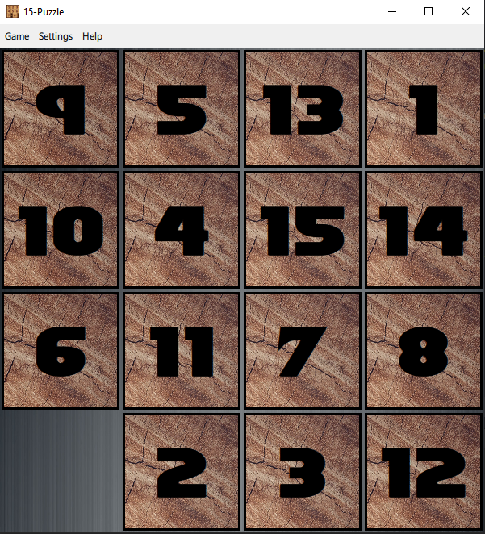
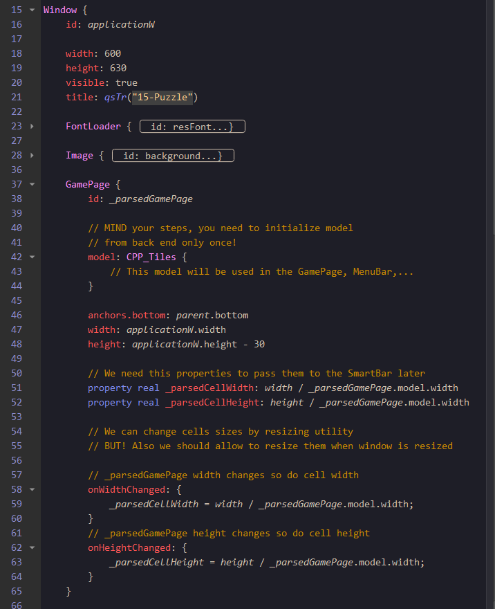
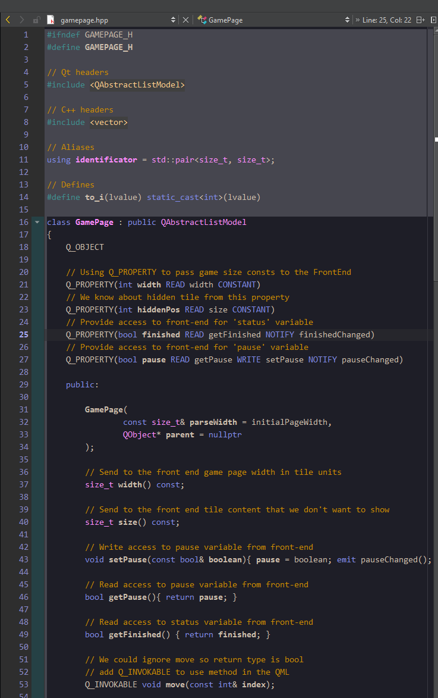
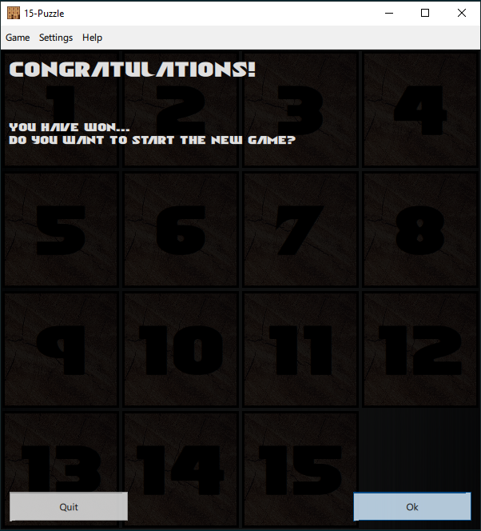
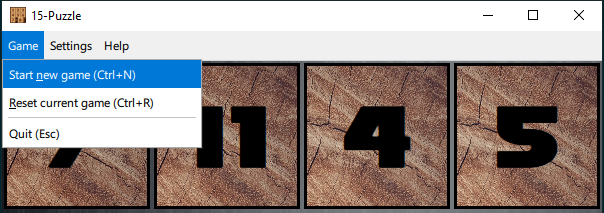
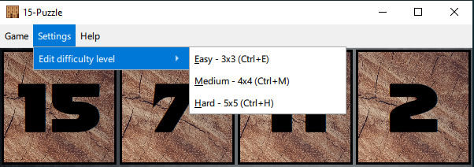
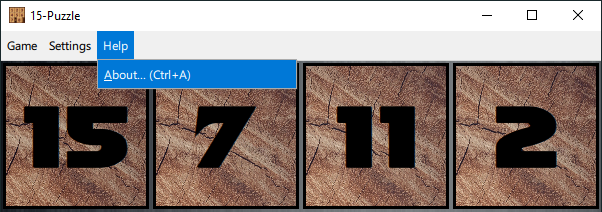
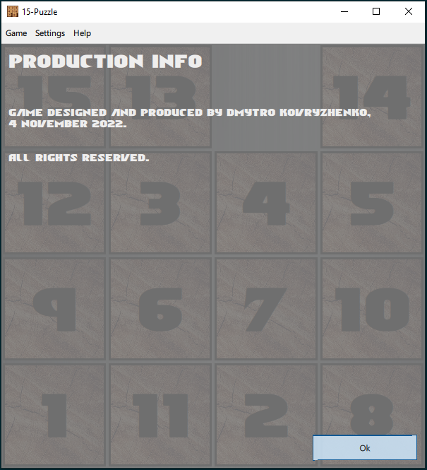
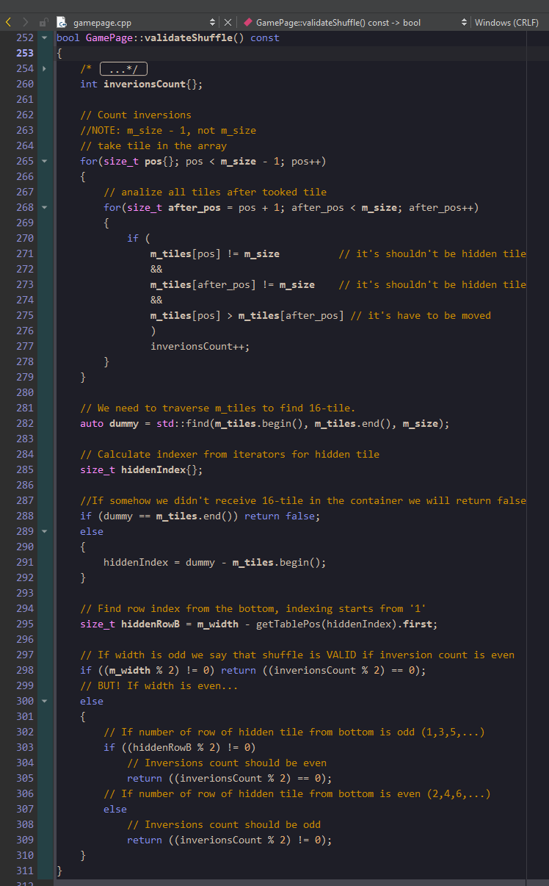

# **Welcome to the Sliding Tiles game!**

**_Wikipedia info:_**

A sliding puzzle, sliding block puzzle, or sliding tile puzzle is a combination puzzle that challenges a player to slide (frequently flat) pieces along certain routes (usually on a board) to establish a certain end-configuration. The pieces to be moved may consist of simple shapes, or they may be imprinted with colours, patterns, sections of a larger picture (like a jigsaw puzzle), numbers, or letters.

Sliding puzzles are essentially two-dimensional in nature, even if the sliding is facilitated by mechanically interlinked pieces (like partially encaged marbles) or three-dimensional tokens. In manufactured wood and plastic products, the linking and encaging is often achieved in combination, through mortise-and-tenon key channels along the edges of the pieces. In at least one vintage case of the popular Chinese cognate game Huarong Road, a wire screen prevents lifting of the pieces, which remain loose. As the illustration shows, some sliding puzzles are mechanical puzzles. However, the mechanical fixtures are usually not essential to these puzzles; the parts could as well be tokens on a flat board that are moved according to certain rules.

Unlike other tour puzzles, a sliding block puzzle prohibits lifting any piece off the board. This property separates sliding puzzles from rearrangement puzzles. Hence, finding moves and the paths opened up by each move within the two-dimensional confines of the board are important parts of solving sliding block puzzles.

The oldest type of sliding puzzle is the fifteen puzzle, invented by Noyes Chapman in 1880; Sam Loyd is often wrongly credited with making sliding puzzles popular based on his false claim that he invented the fifteen puzzle. Chapman's invention initiated a puzzle craze in the early 1880s. From the 1950s through the 1980s sliding puzzles employing letters to form words were very popular. These sorts of puzzles have several possible solutions, as may be seen from examples such as Ro-Let (a letter-based fifteen puzzle), Scribe-o (4x8), and Lingo.

The fifteen puzzle has been computerized (as puzzle video games) and examples are available to play for free on-line from many Web pages. It is a descendant of the jigsaw puzzle in that its point is to form a picture on-screen. The last square of the puzzle is then displayed automatically once the other pieces have been lined up.

___
>**_And I want to introduce you th game that simulate sliding tiles and also could be resizable to the sizes: 3x3, 4x4, 5x5._**

___

**_Project info:_**

_Project was build on the Qt Creator 8.0.1 with the GCC 12.2.0 x64 compiler.
CMake was used as project assembler._

**1. Front-end of the game was build by QML and Qt Quick.**

**2. Game logic have been written on the C++ (main.cpp, gamapage.cpp, gamepage.hpp).**

**3. Win message.**

When you will set all the tiles in the correct order: {1,2,3,...,8(or 15, or 24)} you will receive the next message:

- Click on the 'Ok' button (or press 'Return' button on the keyboard);
- Also you can click on the 'Quit' button (or press 'Esc' button on the keyboard).

**4. Game options.**

You have some options in your game experience:

- Click on the 'Start new game' line (or press apply 'Ctrl+N' shortcut with the keyboard);
- Also you can click on the 'Reset current game' line (or press apply 'Ctrl+R' shortcut with the keyboard);
- And of course you can click on the 'Quit' line (or press 'Esc' button on the keyboard) to close application.

**5. Settings options.**

Take a moment to appreciate a resizing ability. Such ability we use to implement difficulty level:

- Click on the 'Easy - 3x3' level line (or press apply 'Ctrl+E' shortcut with the keyboard) to get 3 by 3 grid view;
- Click on the 'Medium - 4x4' level line (or press apply 'Ctrl+M' shortcut with the keyboard) to get 4 by 4 grid view;
- Click on the 'Hard - 4x4' level line (or press apply 'Ctrl+H' shortcut with the keyboard) to get 5 by 5 grid view;

**6. About message.**

You can go to the menu bar and in the **Help** ribbon find click on the 'Ok' button (or press 'Return' button on the keyboard).

**7. Shuffle validation algorithm.**

last but not least - algorithm of varification of the shuffle.
The problem is that not every shuffle of the tiles can be solved. We need to check it.

I realy appresiate good mathematical hint from here:\
https://www.geeksforgeeks.org/check-instance-15-puzzle-solvable/

It helped to write this code:

___
_P.S.: Don't hesitate to email me, if you have any ideas how this game can be improved:
onemoremagistr@gmail.com_